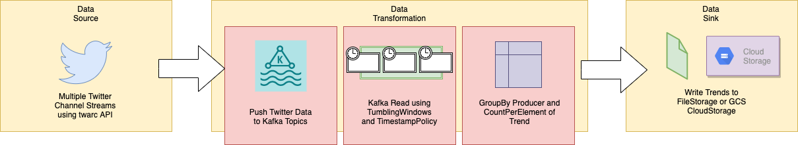

## *Trend Analysis*
---

### Scope
> Process a streaming input of twitter posts from a select news media outlets using Apache Beam.
> Filter an enrich the incoming data with complex transformations to reach the necessary output for trend analysis.

### Current Status
1. SP MT (Single Producer - Multiple Trends)
    * How do the aggregate of news media outlets handle a particular trend
    * For Instance, around late October overall news trends would point towards the Presidential Elections; whereas late January - early February 2021 trends would show trends such as Gamestop and WallStreetBets.
2. MP ST (Multiple Producer - Single Trend)
    * Compare and Contrast how the selected media outlets cover a topic of interest.
    * Helps in identifying bias/skew in interest among the news media groups. We can not only ascertain the frequency of posts by a media house on a trend but also how long they covered it in accordance to the overall trend.
3. MP MT (Multiple Producer - Multiple Trends)
    * Stack and guage how the outlets compare with a variety of trends.
    * This is the motherload, when it comes to trend data against news outlet.
    
### Beam Concepts
The concepts I have dabbled in either in this project or as a prep to this project.
1. Windowing Techniques - Tumbling(Fixed), Global, Sliding and Count Window. TODO - Session Window
2. Sources and Sink - TextIO, KafkaIO, GCS, JDBC (MySQL)
3. Transformations - MapElements, DoFns (complex classes using the DoFn interface), SimpleFunction, GroupByKey, CountPerElement, etc.
4. Miscellaneous - Triggers, SideInput, TimestampPolicies, Watermarks, custom PipelineOptions and Custom Serializers/Encoders.

### Architecture
---
#### Architecture Diagram


#### Architecture Design
1. Twitter channel streams collected using twarc API are pushed to Kafka using an Apache Beam topic producer.
2. The Twitter data is read from Kafka into a bounded source using techniques such as Timestamp Policies and Fixed Windows.
3. Complex transformations are then performed on the bounded source using a combination of custom DoFns, GroupByKeys and CountPerElements based on the requested trend analysis.
4. The output of these complex transformations are then written into either file storage or GCS buckets based on the user's request.

    
#### Proposed Improvements
* Using ```streamlit``` to properly visualize the trend analysis result.
* Incorporate a generic AvroRecord read from Kafka into GCS, thereby facilitating a connector.
* Facilitating user defined Avro coders for serialization and deserialization of the AvroRecord on its journey from Kafka to GCS Buckets.